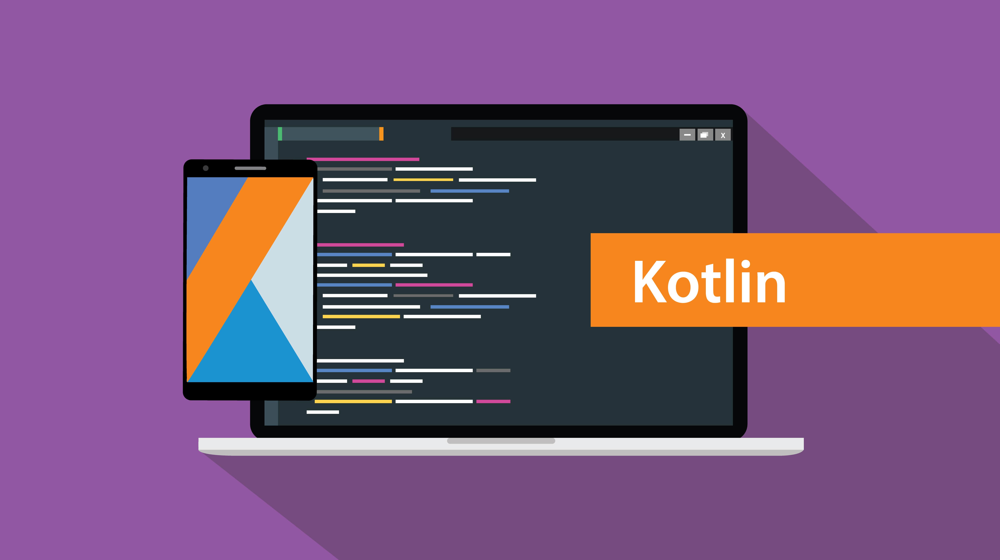

<br/>
<p align="center">
    <a href="https://github.com/TheArchitect123/KmpAppInsights"></a>
</p>

<p align="center">
A Microsoft AppInsights Client compatible for Kotlin Multiplatform. Captures Crash Logs by saving to Disk (optional). Supports both iOS & Android
</p>
<br/>

<p align="center">
   <a href="https://central.sonatype.com/artifact/io.github.thearchitect123/appInsights">
    
  </a>

  <a href="https://github.com/TheArchitect123/KmpAppInsights">
    
  </a>
</p>
<br/>

## How it works
KmpAppInsights handles all the networking, flushing, and saving logs to disk for you. Simply connect you app insights configuration, and it handles the rest for you. 

To get started, import the library into your project:

```sh
implementation("io.github.thearchitect123:appInsights:0.1.5")
```

Please [visit this](https://thearchitect123.github.io/ArtifactsDocProduction/develop/kotlin/multiplatform/kmpAppInsights) for extensive documentation.

## License

This software is licensed under the MIT license. See [LICENSE](./LICENSE) for full disclosure.
